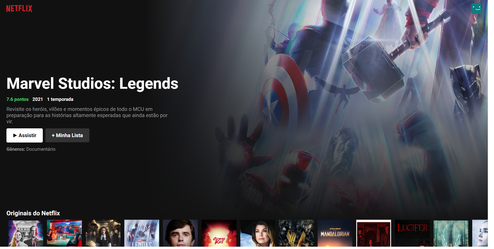
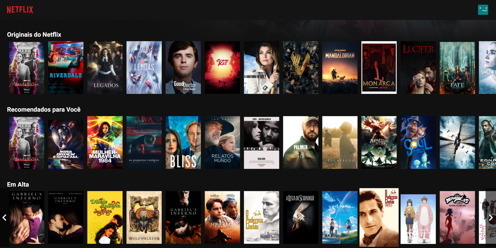

<div align="center">

# Netflix Clone

</div>

<div align="center">

[](https://reactjs.org/)
[](https://material-ui.com/)

</div>

<div align="center">

<i>Let's watch a movie?</i>

</div>




## Description

This React project ilustrates a clone of the Netflix platform design.

## Getting Started

To execute the project, you will need to install Node JS LTS:

- [Node JS LTS](https://nodejs.org/dist/v14.15.4/node-v14.15.4-x64.msi)

## Development

To start Development, you have to clone this repository in a directory on your machine:

```shell
cd "directory"
git clone https://github.com/muriloguerreiro/netflixclone
```

## Build

To build this project, run the following command to download all project dependencies:

```shell
npm install
```

## Run

To run, you need to open the main directory and execute the following command, keeping the terminal open:

```shell
cd netflixclone
npm start
```

Next, your browser will be opened on the initial screen of the Website.

## Deploy

The deployment of the application it's on this link - [Netflix Clone](https://netflixclone.muriloguerreiro.vercel.app/), and it has been synchronized with `Vercel`

## Features

The project allows you to see the movie list only.
Therefore, many features can be implemented, for example:
* Creating a tab containing the movies added to my list.
* Details page for each movie/series.
* Creating authentication for users.

## License

This project is still not protected by a license.
